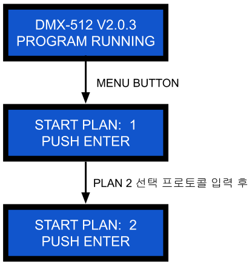

### DMX512M PLAN
DMX512M 컨트롤러는 여러개의 연출 시나리오를 저장하고 있습니다. 각 연출 시나리오는 LCD 상에 PLAN 번호로 표시됩니다. DMX512M 의 PLAN 은 제품 외관에 있는 버튼을 통해 변경하거나 제어 통신포트를 통해 제어가 가능합니다. 제어 통신포트의 설정과 PLAN 선택을 위한 프로토콜은 아래와 같습니다.

### 제어 통신포트 설정
RS-485, 9600 bps, no parity, 8 bits, no flow control

### PLAN 선택 프로토콜

| 명칭(Byte 개수) | **Code**                  | **예) PLAN 1 을 선택**     |
| :------------: | :-----------------------: | :-----------------------: |
| STX(1)         | 0x02                      | 0x02                      |
| HEADER(4)      | 0xFA FF FF F9             | 0xFA FF FF F9             |
| PLAN Number(1) | 0 ~ plan_max              | 0x00                      |
| FOOTER1(8)     | 0x00 00 00 00 00 00 00 01 | 0x00 00 00 00 00 00 00 01 |
| SUM(1)         | sum                       | 0xF4                      |
| FOOTER2(1)     | 0xF7                      | 0xF7                      |
| ETX(1)         | 0x03                      | 0x03                      |

* plan_max: 100
* sum = STX + HEADER + ... + FOOTER1: STX 에서 FOOTER1 까지 바이트 단위 데이터의 합
* 예) PLAN 1 을 선택 할때의 sum: **0xF4** = 0x02 + 0xFA + 0xFF + 0xFF + 0xF9 + 0x00 ... + 0x01

### PLAN 선택 프로토콜 테스트 방법
LCD 창 초기 화면에서 MENU 버튼을 눌러 PLAN 번호를 확인할 수 있습니다. PLAN 선택 프로토콜 입력후에 START PLAN 번호가 변경된 것을 확인 할 수 있습니다.

