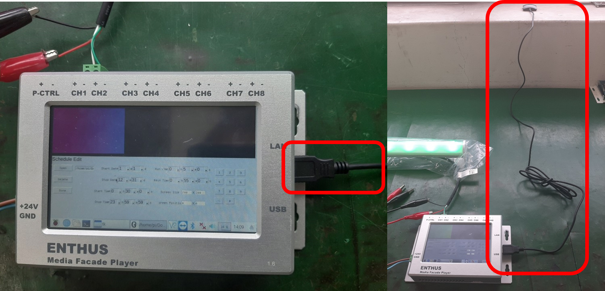

# MFPlayer 테스트

### Touch 테스트
MFPlayer 부팅 후에 화면의 좌우상단 코너를 터치했을때 커서가 해당 위치로 이동하는 것을 확인합니다.

이동한 커서는 다시 터치하기 이전까지 위치를 유지하고 있어야 합니다.

### GPS 테스트
아래와 같이 GPS 를 MFPlayer 에 연결합니다.

GPS 신호를 수신할 수 있는 위치, 건물 외벽 창이 있는 곳에 GPS 안테나를 놓습니다.

10 분 이내에 GPS 신호가 정상 수신되는지를 확인합니다.

정상적으로 수신될 경우 아래와 같이 날짜와 시간이 표시됩니다.

### 출력 테스트
MFPlayer 와 테스트용 시료를 연결하여 정상적인 색상 표현이 되는지를 확인합니다.

테스테용 시료는 pixel 은 20 개 이상 표현이 가능한 `LSB0036-20W20` 또는 유사 기능의 시료를 사용합니다.

시료를 CH1 에 연결합니다.

1. `Stop` 버튼을 누르고,
2. 스케줄 리스트 중 rainbow 로 표시된 스케줄을 선택합니다.

편집 화면으로 전환 뒤에 무지개 색 흐름이 재생되는 것을 확인하고,

테스트용 시료에 정상적으로 연출되는 것을 확인합니다.

시료를 CH2 ~ CH8 에 연결했을 때도 정상적으로 연출되는 것을 확인합니다.
